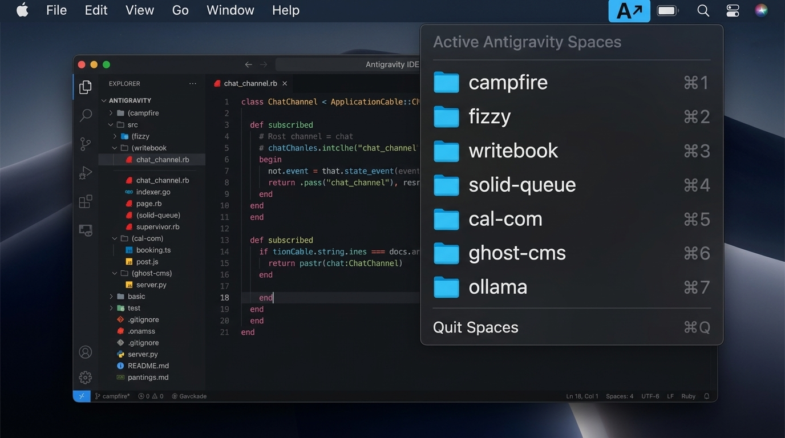

# Antigravity Spaces

### All your workspaces. One keystroke away.

[](https://apple.com)
[](https://swift.org)
[](#)
[](#)
[](LICENSE)

---

Working across multiple active projects in Antigravity shouldn't slow you down.

**Antigravity Spaces** is a native, keyboard-first workspace switcher for macOS. Press **`⌥Space`** (or `⇧Space`), type a couple letters, and you're instantly in your code.



---

## Features

- **Instant HUD.** Summon a frosted glass switcher from any app or full-screen space in milliseconds.
- **Instant Search.** Filter dozens of open repositories and active files as fast as you can type.
- **Quick Jump.** Press **`⌘1` through `⌘9`** to jump directly to any workspace slot.
- **Customizable Shortcuts.** Use ergonomic presets like `⌥Space` or `⇧Space`, or record any custom shortcut from the menu bar.
- **Multi-Display Aware.** Center the switcher on the display with your mouse cursor, or lock it to a preferred monitor.
- **Launch at Login.** Enable automatic startup with a single click from the menu bar.
- **Pure Native Swift.** Handcrafted in AppKit and CoreGraphics. Zero dependencies, <10 MB RAM footprint, and 0% idle CPU.
- **Private by Design.** Operates completely offline. No network requests, no analytics, no telemetry.

---

## Installation

### Option 1: Download Release (Recommended)

1. Download **[Antigravity-Spaces.dmg](https://github.com/ApollosWave/antigravity-spaces/releases/latest/download/Antigravity-Spaces.dmg)** from the [Releases](https://github.com/ApollosWave/antigravity-spaces/releases) page.
2. Drag **Antigravity Spaces.app** into your `/Applications` folder.
3. Open **Antigravity Spaces** from Applications or Spotlight.
4. Click the **`A↗`** menu bar icon and select **Launch at Login**.

> [!NOTE]
> On first launch, macOS will request **Accessibility** permissions so Antigravity Spaces can detect open IDE windows and focus them. Click **Open System Settings** and toggle the permission on.

---

### Option 2: Build from Source

Requirements: macOS 12+, Xcode Command Line Tools (`swiftc`).

```bash
git clone https://github.com/ApollosWave/antigravity-spaces.git
cd antigravity-spaces

# Build native App Bundle and Release DMG
make dmg

# Or run directly in the background
make run
```

---

## Keyboard Reference

| Keystroke | Action |
| :--- | :--- |
| **`⌥Space`** *(or `⇧Space`)* | **Toggle Switcher**: Opens the HUD overlay from any screen or application |
| **Type anything** | Live search projects (e.g. `camp`, `engine`) or active files (e.g. `main.go`) |
| **`↑` / `↓`** | Navigate workspace selection up and down |
| **`Tab` / `⇧Tab`** | Cycle forward and backward through workspaces |
| **`↵ Enter`** | Switch immediately to selected workspace and focus its window |
| **`⌘1` – `⌘9`** | Jump directly to workspace slot 1 through 9 |
| **`Esc`** | Dismiss switcher (or click anywhere outside) |

---

## Shortcuts & Preferences

Configure everything directly from the **`A↗`** menu bar icon:

- **Shortcut Presets:** Switch between `⌥Space`, `⇧Space`, `⌥S`, `⌥W`, `⌥Tab`, `⌥\``, and more with one click.
- **Record Custom Shortcut:** Click *Record Custom Shortcut...*, press your favorite key combo, and save.
- **HUD Display:** Choose *Follow Mouse Cursor (Auto)* or pin to a specific display.
- **Launch at Login:** Keep the switcher ready across system reboots.
- **Quit Spaces (`⌘Q`):** Clean, graceful exit.

---

## Architecture

Antigravity Spaces is engineered with a modular, SOLID Swift architecture:

```
Sources/AntigravitySpaces/
├── App/          # Application delegate & lifecycle coordinator
├── Menu/         # Status bar item, vector icons & dynamic dropdown menu
├── Models/       # KeyCode mappings, shortcut configurations, and workspace items
├── Services/     # Window discovery (Accessibility), hotkey monitoring, preferences
├── Views/        # Gaussian blur HUD, search field, custom table cells & rows
├── Windows/      # Floating HUD panel, shortcut recorder panel & controllers
└── main.swift    # Command-line flags & AppKit entry point
```

---

## License

MIT License. Designed and maintained by [ApollosWave LLC](https://apolloswave.com).
